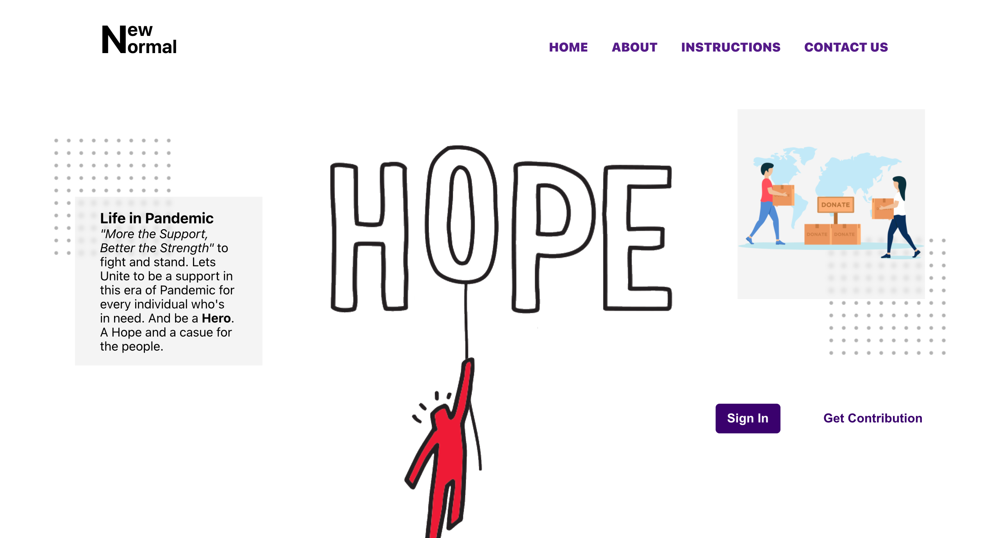
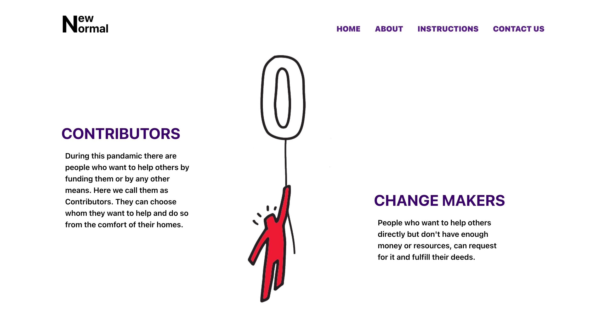
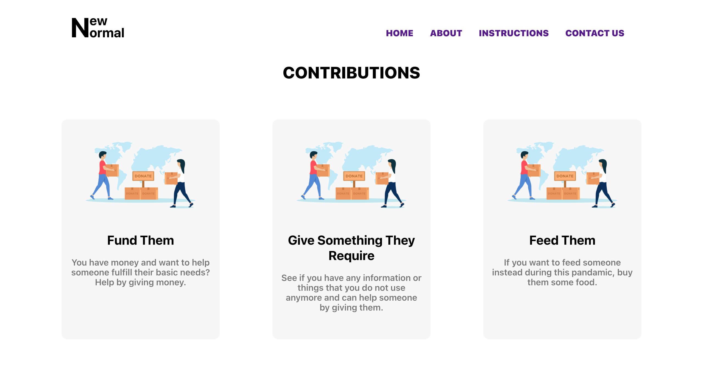
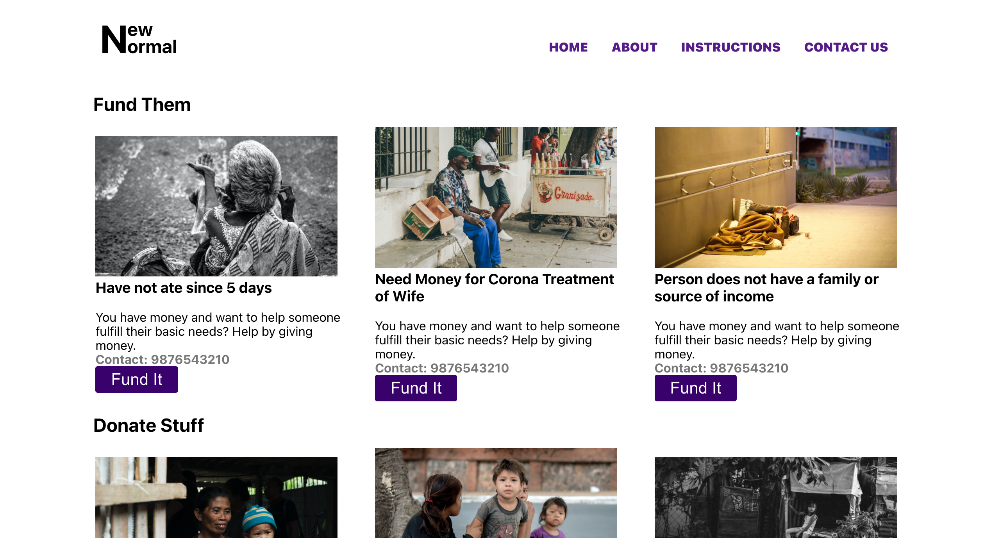
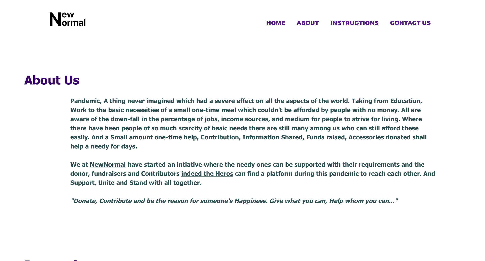
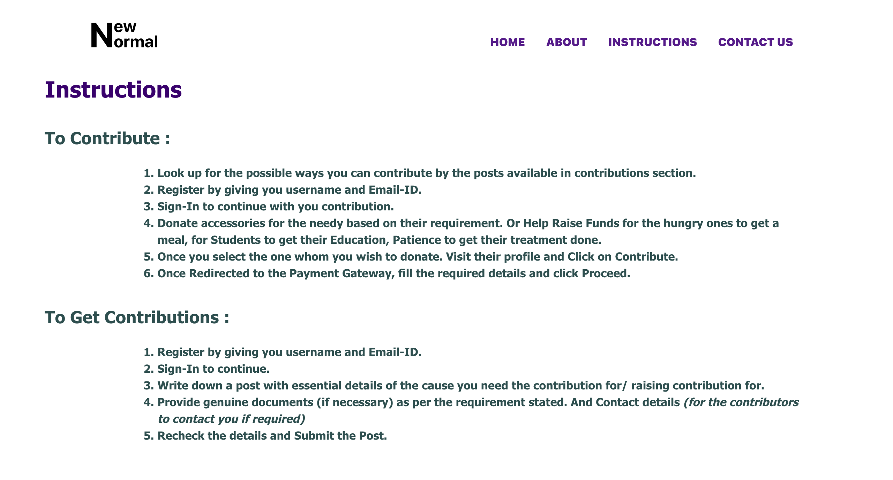

# BunnyFluff

## Introduction:
Coping up hand-in-hand with the Covid-19 Pandemic by extending a helping hand to someone

### Problem It Solves:
Due to the Covid-19 Pandemic, many people have lost their Loved ones, jobs & health as well as wealth. They are barely able to fulfill their basic needs. So, during these crucial moments, the ones who are fortunate enough can act as a godfather and shower some blessings among them. People can send money, feed, or donate possessions that are no longer needed to the ones in need.

### Technologies Used:
* React
* Javascript
* Scss
* React Router
* Jsx

### Team Members:
1) [Ritika Shrestha](https://github.com/RitikaShrestha-me)
2) [Alisha Ahmed](https://github.com/Alisha-Ahmed)

### Snaps:

 
#### Made at:
